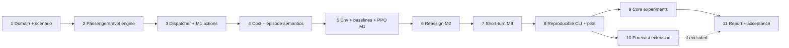

# Dynamic Bus Fleet Control — Implementation Plan v0.2

> **For agentic workers:** REQUIRED SUB-SKILL: Use superpowers:executing-plans to implement task-by-task. Chỉ dùng subagents khi người dùng yêu cầu. Checklist dưới đây chưa được thực thi.

**Goal:** Xây và đánh giá RL điều phối xe dự phòng, headway, reassign và short-turn trên mạng tuyến có sẵn.

**Architecture:** Fixed-tick simulator theo dõi xe/cohort và thực thi resource constraints; Gymnasium adapter tạo control decisions 2 phút. PPO/baselines dùng cùng action table và sensor information. Forecast tách khỏi simulator để kiểm soát information leakage.

**Tech Stack:** Python 3.11, uv, NumPy, NetworkX, PyTorch, Gymnasium, stable-baselines3, sb3-contrib, pandas, Matplotlib, pytest, Ruff.

**Spec:** [spec.md](spec.md). **Research:** [docs/research.md](docs/research.md).

Thay thế plan v0.1 tại commit `a806bb6`; không còn task candidate selection/TNDP.

## Trạng thái triển khai

- **T1 hoàn thành:** domain/scenario/JSON+NPZ IO, hashing, deterministic manifest seeds và test data đã có.
- **T2 hoàn thành:** passenger lifecycle, frozen travel, dwell/layover và fixed-tick NOOP engine đã có.
- **T3 hoàn thành:** static 221-slot action schema, valid-action mask, reserve dispatch, guarded recall, headway target và autonomous terminal dispatch M1 đã có.
- **T4 hoàn thành:** raw passenger/vehicle interval costs, event penalties và terminal-unfinished settlement đã có.
- **T5 hoàn thành:** Gymnasium adapter, fixed-shape observation, horizon/no-future tests, four baselines và MaskablePPO CPU save/load smoke đã qua.
- **T6 hoàn thành:** guarded `REASSIGN` chạy deadhead tới terminal nhận; loaded/moving/cooldown/no-replacement donor đều bị mask trong test.
- **T7 hoàn thành:** `SHORT_TURN` 0→3→0, boarding theo pattern, layover turnpoint/s0, restore FULL, donor/cooldown và threshold prior-share đã có test.
- PyTorch CPU-only đã được khóa và kiểm tra trong `.venv` (`2.14.0+cpu`, CUDA `False`).

## Global Constraints

- Giữ route geometry có sẵn; không arbitrary rerouting hoặc đổi nhiệm vụ xe còn khách.
- Python 3.11, Linux, CPU smoke bắt buộc; package `bus_rl`, src layout, TOML và uv.lock.
- Base: 3 tuyến ×6 trạm, 12 xe (9 assigned+3 reserve), capacity40, comfort30.
- Tick30s, control120s, horizon240 phút/120 decisions, arrivals dừng ở phút180.
- F_max16/R_max4/S_max8; Discrete(221), action/observation schema v2.
- Target headways6/10/15 phút, initial15; floor2 FULL/tuyến; guard20 phút.
- Allocation cooldown20 phút/xe, headway cooldown10 phút/tuyến.
- Reward theo chi phí interval; γ=1.0, N_ref3000 và terminal-unfinished settlement.
- M1=reserve/headway/recall; M2 thêm reassign; M3 thêm short-turn, core chỉ hoàn thành ở M3.
- Forecast optional và causal; controller không nhận realized future hoặc private destination cohorts.
- Conservation trước hiệu quả học; không gọi M1 hoặc reward tăng là “dự án hoàn thành”.

## 1. Lộ trình và gate



Gợi ý tổ chức 5–6 tuần cho một người có nền Python/RL: tuần1 T1–T2; tuần2 T3–T4; tuần3 T5–T6; tuần4 T7–T8; tuần5–6 T9/T11 và T10 nếu còn thời gian. Đây là lịch đề xuất, không cam kết compute hoặc tiến độ chưa biết.

Nếu thiếu thời gian: giữ conservation, ba operational stages và baseline comparison; giảm sweep hoặc bỏ forecast deep trước. Nếu thiếu compute cho 3-seed ablations, báo rõ phần còn thiếu, không âm thầm biến pilot thành full study.

## 2. Interfaces và fixtures dùng chung

Module tree và public signatures ở spec §9. Helper dưới đây được tạo thêm để kiểm chứng phần vật lý độc lập RL:

```python
integrate_tick_costs(state: WorldState, duration_s: int) -> StepCosts
# Pure measurement cho một trạng thái cố định; không tạo boarding/movement.

board_visit(state: WorldState, bus_id: int,
            route_id: int, direction: int, stop_index: int) -> PassengerEvents
# Mutates cohorts/load, trả boarded_count/alighted_count/first_denied_count.
# Engine quyết định một visit hợp lệ, không để caller đổi bus location.

action_id(kind: str, bus_id: int | None = None,
          route_id: int | None = None,
          headway_s: int | None = None) -> int
# Lookup theo action table tĩnh trong spec.
```

`PassengerEvents` là dataclass ba counter trên; boarded/alighted cohorts được cập nhật trong state. Unit test gọi boarding tại vị trí thật của xe; không di chuyển xe bằng helper này.

`tests/fixtures.py` tạo:

- `empty_scenario(stage="M1")`: base spec network/fleet, empty arrival tape, traffic multiplier1; F12, tick30, horizon240min. Stage chỉ override action flags; M2/M3 tests truyền stage tương ứng, physical hash không đổi.
- `waiting_state(n, destination=5)`: state ở t=0 trên empty_scenario, n khách routeA hướng+ tại s0 với đích đã cho, tất cả arrival_tick0; xe0 empty/ready tại s0. Khai báo generated_count=n.
- `short_state()`: như waiting_state(1,destination=5), nhưng control stage M3; xe0 nhận short pattern0→3→0 đã được cấp hợp lệ; không có khách onboard.

Fixtures dùng literal dữ liệu để không phụ thuộc generator đúng mới kiểm engine được. `tests/__init__.py` phải có nếu import `tests.fixtures`.

## Task 1: Domain, synthetic scenarios và IO

**Files:** `pyproject.toml`, `uv.lock`, `.python-version`, `.gitignore`, `configs/base.toml`, `src/bus_sim/oracle/domain.py`, `src/bus_rl/execution/scenarios/{generation,io}.py`, `tests/{__init__,fixtures,test_data}.py`.

**Consumes:** spec §2–3, §7 và §9.

**Produces:** typed dataclasses, `generate_scenario`, `save_scenario`, `load_scenario`, `initial_state`; immutable Scenario/read-only tapes và mutable WorldState riêng.

- [x] Setup package/deps bằng uv; khóa Python3.11 patch và CPU PyTorch sau import smoke. Ignore generated datasets/checkpoints/cache; giữ manifests nhỏ, configs và selected reports.
- [x] Viết seed/roundtrip tests; reject sai direction/destination, negative counts, non-tick timestamps, F/R/S vượt encoding. Scenario zero-demand hợp lệ.

```python
def test_scenario_roundtrip_has_same_demand(tmp_path):
    import numpy as np
    from bus_rl.data.io import save_scenario, load_scenario
    from tests.fixtures import empty_scenario

    scenario = empty_scenario()
    save_scenario(scenario, tmp_path)
    restored = load_scenario(tmp_path)
    np.testing.assert_array_equal(restored.arrival_tape, scenario.arrival_tape)
    assert restored.scenario_hash == scenario.scenario_hash
```

- [x] Chạy fail rồi implement JSON+numeric NPZ, no pickle; hash bỏ timestamp audit, giữ semantic config/data.
- [x] Implement base network/initial fleet, Poisson+peak generator và indexed edge/time traffic. Destination prior và demand totals dùng đúng đơn vị spec.
- [x] Implement manifests500/100/200/200/200 ngày và child-seed dedup; test suite dùng 2–3 ngày mỗi split cho nhanh. Ghi rõ cùng topology là intentional.
- [x] `uv run pytest tests/test_data.py -q`; `uv run ruff check .`; pass rồi commit `feat: define dynamic bus scenarios and conserved domain state`.

**Gate:** Scenario không bị mutate khi reset, cùng seed→cùng tapes/hash; không có người ngoài demand window.

## Task 2: Passenger lifecycle, travel và tick engine

**Files:** `src/bus_sim/oracle/{engine,passengers,vehicles,travel}.py`, `tests/{test_passengers,test_vehicles,test_engine}.py`.

**Consumes:** T1 scenario/world; events và timing spec §4.

**Produces:** boarding/alighting, abandonment, movement/dwell/layover và `advance_interval` engine plumbing; actions tạm chỉ NOOP trước T3.

- [x] Viết capacity/conservation test và split cohort đúng lineage. Boarding second visit không được đếm lại first_denied đối với cùng người.

```python
def test_capacity_denial_keeps_waiting_passengers():
    from tests.fixtures import waiting_state
    from bus_rl.sim.passengers import board_visit

    state = waiting_state(45)
    event = board_visit(state, bus_id=0, route_id=0, direction=1, stop_index=0)
    assert event.boarded_count == 40
    assert event.first_denied_count == 5
    assert state.waiting_count == 5
    assert state.onboard_count == 40
    assert state.generated_count == state.waiting_count + state.onboard_count
```

- [x] Chạy fail, implement eligibility/FIFO trước capacity. Các summary count properties của WorldState tính từ cohorts hoặc được đối chiếu mỗi tick để tránh cache drift.
- [x] Implement edge travel freeze ở entry, round-up30s; test traffic đổi khi bus đang trên edge không đổi arrival cũ, xe vào sau dùng field mới.
- [x] Test alight ở đúng đích, terminal turnaround, dwell30s, layover120s và patience45min tie-break trước boarding.
- [x] Implement đúng event order, visit ID chống duplicate processing và cost/events tại final boundary H. Audit log bus/passenger events có timestamp.
- [x] Chạy `uv run pytest tests/test_passengers.py tests/test_vehicles.py tests/test_engine.py -q`, pass rồi commit `feat: simulate passenger flow and physical bus movement`.

**Gate:** conservation mỗi tick; demand/tapes không đổi theo thứ tự controller gọi RNG; không virtual teleport.

## Task 3: Dispatcher và M1 operational actions

**Files:** `src/bus_sim/oracle/dispatcher.py`, `src/bus_sim/oracle/{actions,guards}.py`, `tests/test_control.py`; nối engine.

**Consumes:** T2 physical engine.

**Produces:** `build_action_table`, `action_id`, `valid_action_mask`, reserve dispatch/headway/recall và autonomous normal service.

- [x] Viết action-table test đúng221 IDs, padding masked, NOOP valid. REASSIGN/SHORT slots giữ nguyên nhưng disabled tại M1.
- [x] Viết test dispatch xe9 reserve: sau một interval120s vẫn deadhead trên connector360s; không boarding target s0 trước khi đến.

```python
def test_dispatch_consumes_time_and_one_reserve():
    from tests.fixtures import empty_scenario
    from bus_rl.domain import initial_state
    from bus_rl.control.actions import build_action_table, action_id
    from bus_rl.sim.engine import advance_interval

    scenario = empty_scenario()
    state = initial_state(scenario)
    action = build_action_table()[action_id("DISPATCH", bus_id=9, route_id=0)]
    advance_interval(state, scenario, action)
    assert state.current_time_s == 120
    assert state.vehicles[9].phase == "DEADHEAD"
    assert state.vehicles[9].load == 0
    assert state.depot_count == 2
```

- [x] Chạy fail, implement dispatch reserve, donor floor/ready replacement guard cho recall, cooldown20min. Không chặn normal scheduler vì vehicle allocation cooldown.
- [x] Implement target headway và extra first departure; test target6min không tạo thêm xe, actual headway chỉ đổi khi có departure thật. Test minimum spacing và target cooldown10min.
- [x] Chạy NOOP toàn ca với empty demand: xe vẫn phục vụ/turnaround, tổng F không đổi. Test recall donor dưới floor bị mask.
- [x] `uv run pytest tests/test_control.py tests/test_engine.py -q`; pass, commit `feat: dispatch finite reserve buses and control target headways`.

**Gate:** M1 physical operation chạy được; target request không bị đánh đồng achieved frequency.

## Task 4: Cost, fairness và finite horizon accounting

**Files:** `src/bus_sim/oracle/costs.py`, `tests/test_rewards.py`; bổ sung event counters vào engine.

**Consumes:** raw WorldState/passenger events.

**Produces:** `StepCosts`, `integrate_tick_costs`, `interval_cost`, terminal settlement đúng spec §6.

- [x] Viết arithmetic oracle independent, cost không dựa vào reward đã tính.

```python
def test_ten_people_waiting_five_minutes_is_fifty():
    from tests.fixtures import waiting_state
    from bus_rl.rewards.costs import integrate_tick_costs

    costs = integrate_tick_costs(waiting_state(10), duration_s=300)
    assert costs.waiting_pm == 50.0
```

- [x] Chạy fail, implement queue/onboard/crowd/active/deadhead/excessive-wait integrals và once-only event costs. So split5min thành10 intervals30s cho cùng trạng thái cố định.
- [x] Test first-denied5 + abandon5 là hai event semantics riêng; no repeat penalty theo tick. Hard capacity violation không được “mua” bằng soft crowd penalty.
- [x] Test customer còn queue/onboard tại H bị settlement60/người, không disappear; người abandon trước H không settlement lần nữa.
- [x] Test tổng reward khớp âm total raw costs/3000; zero demand finite, mean waiting=None, không normalization theo future realized demand.
- [x] `uv run pytest tests/test_rewards.py tests/test_engine.py -q`; pass, commit `feat: account for waiting operating and unfinished-service costs`.

**Gate:** không bỏ khách khó, không reward chỉ đếm khách đã lên; interval/horizon accounting được xác nhận.

## Task 5: Observation, Gymnasium, baselines và PPO M1

**Files:** `src/bus_sim/oracle/observation.py and src/bus_rl/execution/environments/python/environment.py`, `src/bus_rl/learning/baselines/{fixed,threshold,proportional,random}.py`, `src/bus_rl/learning/policy.py`, `src/bus_rl/learning/training/{train,callbacks}.py`, `configs/pilot.toml`, `tests/{test_env,test_baselines,test_model}.py`.

**Consumes:** M1 engine, action guards, costs.

**Produces:** `BusDispatchEnv`, fixed-shape Dict observation, `Controller.act(obs,mask)->int`, MaskablePPO integration.

- [x] Viết shapes/dtypes tests theo spec: vehicles16×27, stops4×2×8×7, action221. Observation/info controller không chứa future tape, scenario seed hoặc raw latent destination.
- [x] Implement history5×2min chỉ past; padding0, entity masks, elapsed/remaining time, forecast flag=0.
- [x] Test120 decisions=240min, `terminated=True` và `truncated=False`, reward conservation; invalid action API raises ValueError. Stock random env checker không dùng mask, không nới constraint để chiều checker.
- [x] Implement Fixed=NOOP và Random-valid với seed riêng. Threshold M1 dùng urgency `Q_r/(40*max(1,n_full_r)) + max_age_r/900 + max_gap_r/1200`, tie route ID; nếu Q_r≥40 ưu tiên dispatch reserve hợp lệ; sau đó SET_HEADWAY6 khi Q_r≥80,10 khi40≤Q_r<80,15 khi Q_r<40; recall khi Q_r<5 và guard cho phép. Chỉ một action, nếu không có lựa chọn hợp lệ trả NOOP.
- [x] Proportional: estimated rates từ arrivals10min; desired active budget9, tăng12 nếu tổng queue≥120; floor2/tuyến, phân remainder theo largest-remainder tỷ lệ rates (zero rate chia đều). Thực thi thiếu xe bằng dispatch, dư xe bằng recall; headway gần nhất trong6/10/15 theo nominal full cycle/desired fleet. Không sửa fleet count trực tiếp.
- [x] Implement PPO feed-forward, γ1, masked evaluation và shared MLP trong `models/features.py`. Chạy tiny CPU smoke trước khi custom full train pipeline. M1 config dùng enable_reassign=false, enable_short_turn=false mà không đổi physical scenario hash.

```python
def test_masked_ppo_save_load_preserves_action(tmp_path):
    from sb3_contrib import MaskablePPO
    from bus_rl.execution.environments.python.environment import BusDispatchEnv
    from tests.fixtures import empty_scenario

    scenario = empty_scenario()
    env = BusDispatchEnv([scenario], scenario.config)
    model = MaskablePPO(
        "MultiInputPolicy",
        env,
        gamma=1.0,
        n_steps=16,
        batch_size=16,
        n_epochs=1,
        seed=11,
        device="cpu",
        verbose=0,
    )
    model.learn(total_timesteps=32)
    obs, _ = env.reset(seed=7)
    mask = env.action_masks()
    action, _ = model.predict(obs, action_masks=mask, deterministic=True)
    assert mask[int(action)]
    model.save(tmp_path / "smoke")
    restored = MaskablePPO.load(tmp_path / "smoke", env=env)
    other, _ = restored.predict(obs, action_masks=mask, deterministic=True)
    assert int(action) == int(other)
```

- [x] Thêm test architecture dự án [256,128] shared + actor/critic128; test bất kỳ key feature bị NaN đều bị reject trước training. Smoke32steps không chứng minh policy tốt.
- [x] `uv run pytest tests/test_env.py tests/test_baselines.py tests/test_model.py -q`; pass, commit `feat: train and compare masked bus controllers at milestone one`.

**Gate M1:** physical simulator+env+baselines+PPO end-to-end chạy được; chưa gọi core hoàn thành.

## Task 6: Reassignment giữa tuyến — M2

**Files:** sửa `control/actions.py`, `control/guards.py`, `sim/vehicles.py`, `baselines/{threshold,proportional}.py`, `tests/{test_control,test_baselines}.py`; `configs/experiments/m2.toml`.

**Consumes:** M1 ready/empty fleet, compatibility, terminal/deadhead paths.

**Produces:** REASSIGN operational, audit donor/receiver và action ablation flag.

- [x] Test xe loaded hoặc moving hoặc cooldown bị mask; same-route reassign bị mask; donor sau remove còn1 FULL bị mask.
- [x] Test donor còn2 FULL nhưng không có replacement ready đúng terminal cũng bị mask; không chỉ kiểm count toàn tuyến.
- [x] Implement acceptance chuyển xe sang DEADHEAD, không được tính vừa donor vừa receiver FULL. Arrival tới receiver s0 mới thành extra-departure pending.
- [x] Test routeA→B mất travel time thực, no teleport; donor guard checks trước action và logged actual headway violation sau traffic để không nhầm guard với guarantee.
- [x] Threshold sau hết reserve chọn donor urgency thấp nhất có action hợp lệ; proportional chọn donor vượt desired và receiver thiếu, tie ID. Nếu không khả thi thì NOOP/headway, không dùng private state bypass guard.
- [x] `uv run pytest tests/test_control.py tests/test_baselines.py -q`; chạy seeded M2 rollouts, commit `feat: reallocate empty buses through feasible terminal transfers`.

**Gate M2:** resource conservation và donor protection đúng khi dispatch/reassign/recall xen kẽ.

## Task 7: Short-turn mission — M3

**Files:** sửa `control/actions.py`, `sim/{passengers,vehicles,dispatcher}.py`, `baselines/threshold.py`, `tests/{test_passengers,test_control,test_engine}.py`; `configs/experiments/m3.toml`.

**Consumes:** predefined route patterns, M2 engine.

**Produces:** SHORT_TURN một round trip0→3→0, đủ điều kiện boarding/layover, rồi FULL.

- [x] Viết test khách đi tới s5 không được lên short mission từ s0.

```python
def test_short_turn_does_not_strand_long_distance_passenger():
    from tests.fixtures import short_state
    from bus_rl.sim.passengers import board_visit

    state = short_state()
    event = board_visit(state, bus_id=0, route_id=0, direction=1, stop_index=0)
    assert event.boarded_count == 0
    assert event.first_denied_count == 0
    assert state.waiting_count == 1
```

- [x] Chạy fail, implement passenger eligibility trước boarding. Test reverse direction khách s3→s1 được đi sau turnaround; all outbound khách xuống đúng destination.
- [x] Test short action chỉ từ reserve hoặc empty/ready cùng route s0; short nhận từ assigned bus phải qua donor guard và tạm không tính FULL floor.
- [x] Implement layover120s tại turnpoint và lúc về s0, pattern restore FULL sau completion. Không reset cooldown để tạo chuỗi short miễn phí.
- [x] Threshold ước lượng short-eligible mass từ aggregate origin/direction queues và prior downstream `exp(-distance/2)`; nếu estimated share≥0.7 và Q≥40 chọn short reserve trước full reserve, không đọc actual hidden destinations. Targeted short-ready assigned bus là fallback chỉ khi mask hợp lệ.
- [x] Test long-distance starvation case và excessive-wait metrics; không auto-reassign người ngoài pattern sang tuyến khác.
- [x] `uv run pytest tests/test_passengers.py tests/test_control.py tests/test_engine.py -q`; commit `feat: operate predefined short-turn reinforcement trips`.

**Gate M3:** đủ core actions, mọi khách được bảo toàn và không ai bị buộc xuống trước đích.

## Task 8: CLI, provenance, evaluation và pilot

**Files:** `src/bus_rl/cli.py`, `training/checkpoint.py`, `evaluation/{runner,statistics,profile}.py`, `configs/{train,eval}.toml`, `tests/test_pipeline.py`, `reports/pilot.md`.

**Consumes:** M3 core.

**Produces:** CLI, run metadata/CSV, profiler, completed pilot và best-checkpoint selection.

```bash
uv run bus-rl generate --config configs/base.toml --output data/generated/base
uv run bus-rl baseline --manifest data/generated/base/manifest.json --split validation --methods fixed,threshold,proportional --output runs/baselines
uv run bus-rl profile --config configs/pilot.toml --decisions 120 --output runs/profile
uv run bus-rl train --config configs/pilot.toml --seed 11 --output runs/pilot-11
uv run bus-rl evaluate --config configs/eval.toml --checkpoint runs/pilot-11/best.zip --split validation --output runs/pilot-11/eval
```

- [ ] Viết subprocess smoke với2train/1validation/1test scenarios và32trainingsteps; assert output/CSV và nonzero exit khi output tồn tại.
- [ ] Implement scenario/run metadata: action/obs/config/schema hashes, tapes, git SHA/dirty, lock hash, device, seeds, actual transitions/episodes, wall time. Fresh training only; load mismatched schema/config phải lỗi.
- [ ] Raw metrics CSV per method/model_seed/scenario; event trace riêng để audit. Waiting của cả demand có censor/abandon flags, per-route metrics, actual headways, cost components. Physical/control/reward hashes riêng: ablation override control/reward được phép, đổi physical config khi load checkpoint/data phải reject.
- [ ] Test paired statistics với mọi difference=2 cho CI[2,2]; bootstrap theo ngày sau mean model seeds, không xem3×N rows là independent.
- [ ] Chạy profiling120 decisions với empty/light/peak demand; đo engine/passenger/sensor/PPO breakdown và peak RSS, không chỉ inference GPU.
- [ ] Chạy pilot12,288 transitions, validation100days mỗi12,288; nếu chưa có learning signal kiểm tiny deterministic overloaded scenario trước khi tăng budget. Không cần thắng heuristic để pass plumbing gate.
- [ ] Ghi dự toán full runtime dựa measurement, phân biệt estimate/actual. Không cache state động chỉ theo tổng queue; cache chỉ immutable shortest paths/traffic keys phù hợp.
- [ ] `uv run pytest tests/test_pipeline.py -q`; commit code+pilot report `feat: reproduce and profile dynamic fleet control experiments`.

**Gate:** có tài nguyên đo thực và artifact lineage trước full experiments.

## Task 9: Core training và action/reward ablations

**Files:** `configs/experiments/{core,no_reassign,no_short,fairness_zero}.toml`; artifacts `runs/`, `reports/results/`; cập nhật evaluator nếu cần.

**Consumes:** frozen manifests, M3 và T8 pilot.

**Produces:** 4 configurations×3seeds=12 full training runs và paired evaluation. Không đổi kiến trúc trong lúc so ablation.

- [ ] Khóa configs trước test; tune threshold/proportional trên validation với cùng exogenous tapes. Ghi số tổ hợp/compute và công thức urgency đã chọn.
- [ ] Train core245,760transitions cho seeds11,22,33, best checkpoint theo validation total cost/3000.

```bash
uv run bus-rl train --config configs/experiments/core.toml --seed 11 --output runs/core-11
uv run bus-rl train --config configs/experiments/core.toml --seed 22 --output runs/core-22
uv run bus-rl train --config configs/experiments/core.toml --seed 33 --output runs/core-33
```

- [ ] Lặp ba seed cho no_reassign, no_short và fairness_zero; giữ 221 slots và mask disabled, guards/fleet/tapes/compute không đổi. Với fairness_zero chỉ bỏ F_t term, không bỏ donor protection.
- [ ] Đánh giá trên200test_id +200burst +200traffic days cho từng run, cùng baseline sensors/actions; flag các action subsets rõ khi so với full controller.
- [ ] Re-evaluate cost chung theo trọng số core từ raw components khi so reward ablation; không so score khác định nghĩa như cùng metric.
- [ ] Báo cost, all-demand observed wait/P95 và censoring, completed/abandoned/unfinished, worst-route quality, actual headways, active/deadhead time, unique denied.
- [ ] Paired bootstrap2,000 resamples seed6001, mean/std model seeds riêng; phân tích không thắng hoặc OOD kém bằng event traces.
- [ ] Không chọn ngày đẹp hoặc seed tốt nhất; lưu mọi run fail và nguyên nhân. Nếu budget không đủ, ghi những run chưa thực hiện và không đánh dấu hoàn thành.

**Gate:** đủ core+ablations tái lập, không yêu cầu RL thắng baselines.

## Task 10: Forecast experiment — optional

**Files:** `src/bus_rl/forecasting/historical.py`, `configs/experiments/forecast.toml`, `tests/test_forecast.py`; forecast metadata/results.

**Consumes:** train-day **arrival logs**, not queues; past observation history.

**Produces:** `HistoricalForecaster.fit(train_logs)`, `predict(history, time_s) -> Forecast`, no-future-leak tests và forecast/no-forecast result nếu chạy.

- [ ] Viết test hai tapes giống hệt ở≤t nhưng khác sau t: forecast tại t phải bằng nhau. Dùng sentinel object để fail nếu predictor truy cập future tape/scenario seed.
- [ ] Implement time-bin mean+recent correction đúng spec §7.3; zero history dùng smoothing+1, không NaN.
- [ ] Fit chỉ train và freeze; đánh giá15-minute forecast MAE/bias trên validation/test demand logs. Không fit lại sau nhìn test metrics.
- [ ] Policy giữ same shape forecast tensor, flag distinguishes enabled; train forecast3seeds và so no-forecast core trên cùng days/budget.
- [ ] Báo contribution riêng của forecast error và control; perfect-future oracle nếu thêm phải tách nhãn và không dùng làm online baseline.
- [ ] `uv run pytest tests/test_forecast.py -q`; commit `feat: add causal historical demand forecasts for control` nếu thực hiện.

**Gate optional:** không leak tương lai; thiếu task này không chặn core M3 nhưng final report phải nói forecast chưa đánh giá.

## Task 11: Report, visualization và acceptance

**Files:** `src/bus_rl/evaluation/plots.py`, bổ sung CLI report, `README.md`, `reports/final.md`, selected PNG/SVG; cập nhật checkboxes.

**Consumes:** raw CSV/events/configs từ T9 và T10 nếu có.

**Produces:** kết quả đọc độc lập và hướng dẫn tái lập.

- [ ] Test plot rendering headless với zero-demand/censored days và baseline không có model seed; không crash do None.
- [ ] Tạo route×time queue heatmap, fleet allocation timeline, bus mission Gantt gồm deadhead, target-vs-actual headway, waiting/CDF và learning curves3seeds. Hình phải có đơn vị/phạm vi M3 và không che abandonment.

```bash
uv run bus-rl report --results runs/core-11/eval/results.csv --output reports/core-11
```

- [ ] Viết final report: bài toán, giới hạn sensing/driver/traffic, giả định POMDP, reward weights, baselines, compute actual, ID/OOD, ablations và failure cases. Link mỗi bảng với artifacts.
- [ ] README setup `uv sync --locked`, tiny smoke, generate/baseline/train/evaluate/report; nói rõ file/model lớn cần tái tạo và configs đã dùng.
- [ ] Chạy acceptance cuối:

```bash
uv sync --locked
uv run ruff check .
uv run ruff format --check .
uv run pytest -q
uv run bus-rl evaluate --config configs/eval.toml --checkpoint runs/core-11/best.zip --split test_id --output runs/recheck-core-11
```

- [ ] Đối chiếu route missions/quality metrics với run gốc, elapsed time có thể khác. Audit ít nhất một reserve dispatch, reassign và short-turn bằng event trace và conservation counts.
- [ ] Chỉ đánh dấu task hoàn thành khi có bằng chứng; report kết quả tiêu cực trung thực. Commit code/docs/report, không commit dữ liệu/checkpoint lớn vô tình.

**Gate cuối:** toàn bộ spec §10.4 được kiểm chứng; core M3 đầy đủ, learning và comparison có thể tái lập.

## 3. Coverage map

| Yêu cầu | Task | Bằng chứng |
|---|---|---|
| Network có sẵn, synthetic demand/traffic | T1 | Scenario/schema/tape tests |
| Physical fleet + passenger conservation | T2 | Tick invariants/event traces |
| Reserve/headway/recall | T3 | M1 engine tests |
| Reward/censoring/final settlement | T4 | Arithmetic/timing tests |
| Sensor/POMDP boundaries + PPO | T5 | No-future features, masked smoke |
| Reassign/donor protection | T6 | Terminal/loaded/floor tests |
| Short-turn | T7 | Downstream eligibility/turnaround |
| Reproducible training/profiling | T8 | CLI, hashes, measured performance |
| Baselines + 3-seed ablations | T9 | Raw paired ID/OOD results |
| Forecast | T10 optional | Leakage tests + MAE/control comparison |
| Accessible final explanation | T11 | Sources, plots, reproduction steps |

## 4. Rủi ro cần xử lý bằng bằng chứng

- Queue giảm đột ngột: kiểm boarding/abandon conservation trước kết luận policy tốt.
- Headway nhỏ nhưng không có xe: kiểm actual departures; target không phải achieved service.
- Waiting giảm nhưng onboard/unfinished tăng: kiểm reward và horizon gaming.
- Reassign quá nhiều: kiểm cooldown/deadhead cost, không thêm penalty theo cảm tính khi simulator còn sai.
- Worst route kém: xem floor/guard và excess-wait metrics; variance nhỏ không chứng minh fairness.
- PPO không thắng threshold: dùng deterministic toy và forecast ablation để tách optimization khó khỏi bug; không thay test set.
- Simulator chậm: profile cohort splitting/history aggregation; không bỏ constraints để tăng steps/s.

Kế hoạch này cập nhật bộ tài liệu theo định nghĩa mới; chưa thực thi code hoặc training. Khi triển khai, bắt đầu T1 và đi qua từng gate.
