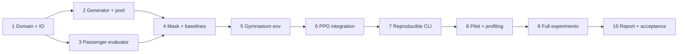

# Fixed Bus Network RL — Implementation Plan

> **For agentic workers:** REQUIRED SUB-SKILL: Use superpowers:executing-plans to implement this plan task-by-task. Chỉ dùng superpowers:subagent-driven-development nếu người dùng yêu cầu thực hiện bằng subagents. Các bước dùng checkbox để theo dõi.

**Goal:** Xây pipeline tái lập cho RL chọn mạng tuyến bus cố định trên synthetic cities và đánh giá công bằng với heuristic.

**Architecture:** Domain và transit evaluator thuần Python/NumPy/NetworkX là nền tảng chung. Gymnasium env xây mạng bằng cách chọn tuyến ứng viên; MaskablePPO học policy. CLI nối generation, baseline, training, evaluation và reporting.

**Tech Stack:** Python 3.11, uv, NumPy, NetworkX, PyTorch, Gymnasium, stable-baselines3, sb3-contrib, pandas, Matplotlib, pytest, Ruff; config TOML.

**Spec:** [spec.md](spec.md). **Research:** [docs/research.md](docs/research.md).

**Trạng thái:** tài liệu triển khai, chưa thực thi các task dưới đây. Mọi lệnh `uv run`, `bus-rl`, pytest và chữ ký hàm dưới đây là giao diện dự kiến sau khi task tương ứng được implement; không phải báo cáo lệnh đã chạy thành công.

## Global Constraints

- Python 3.11; Linux; CPU là cấu hình kiểm thử bắt buộc.
- Package `bus_rl`, layout `src/`; lock dependency khi setup bằng `uv.lock`.
- Base: N=20; N_max=32; M_max=512; K=4; 2≤L≤8; edge-time 1–8 phút.
- B=100 phút tổng route-time một chiều; h=10 phút; τ=3 phút; q=2.
- α=0.7; λ_u=2.0; γ=1.0; không cộng terminal reward hai lần.
- Ba training seeds: 11, 22, 33; mọi phương pháp dùng cùng pool/config/evaluator.
- Không làm GNN, timetable, capacity, web app hoặc dữ liệu thực trong MVP.
- Không đổi objective, transfer semantics hay schema mà không cập nhật spec/version.
- Không chọn checkpoint theo test; lưu artifacts thay vì chỉ ảnh kết quả.
- Các task code có vòng test fail → implementation → test pass; commit khi deliverable qua kiểm chứng. Không tạo commit chứa thay đổi ngoài task.

## 1. Trình tự và gate



Thực hiện tuần tự để giảm integration risk. Mỗi task có đầu ra kiểm chứng độc lập. Mốc thời gian dưới đây là ước lượng tổ chức cho một người đã biết Python, không phải cam kết training runtime:

| Tuần đề xuất | Công việc | Gate |
|---|---|---|
| 1 | T1–T3 | Dữ liệu đọc/ghi và evaluator tính tay đúng |
| 2 | T4–T5 | Baselines, masks và env đúng |
| 3 | T6–T8 | Model save/load, pilot và profiler |
| 4 | T9–T10 | Thí nghiệm, phân tích, báo cáo |

Nếu tuần 2 chưa qua evaluator gate, giữ quy mô tiny và sửa correctness; không bù bằng tăng training. Nếu thiếu compute, giữ base+dense/terminal trên 3 seeds; bỏ sweep mở rộng trước khi bỏ kiểm chứng cốt lõi.

## 2. File ownership và interfaces

Danh sách module đầy đủ nằm ở spec §6. Mỗi task chỉ tạo những file được liệt kê; tạo `__init__.py` cần thiết trong các package mới. `tests/fixtures.py` chứa fixture dùng chung; không hard-code logic evaluator vào fixture để tạo expected output.

Fixture chung được xây ở T1:

```python
# tests/fixtures.py — các helper phải tạo dataclass thật, không gọi solver.
line_instance() -> Instance
# N=3; edges 0-1=4, 1-2=4; D[0,2]=10, OD khác=0;
# candidates=((0,1,2), (0,1), (1,2)); K=2; B=20;
# h=10; tau=3; max_transfers=2; max_stops=8; edge_max=8.

tiny_instance() -> Instance
# N=4; edges 0-1=4, 1-2=4, 2-3=4, 3-0=4, 0-2=5;
# D[0,2]=20, D[1,3]=10; OD khác=0;
# candidates=((0,1,2),(0,3,2),(1,2,3),(0,2)); K=2; B=20.

budget_instance() -> Instance
# N=4; edges 0-1=8, 0-2=6, 0-3=4; D[1,2]=10;
# candidates=((0,1),(0,2),(0,3)); K=2; B=10.
```

Fixture không cần canonical sort theo generator vì IDs ở đây là cố ý để assert; loader vẫn kiểm tra uniqueness/path/budget. Candidate sorting chỉ là contract của generator, không phải validity của mọi imported pool.

## Task 1: Domain, environment setup và instance IO

**Files:** `pyproject.toml`, `uv.lock`, `.python-version`, `.gitignore`, `src/bus_rl/domain.py`, `src/bus_rl/data/io.py`, `tests/fixtures.py`, `tests/test_data.py`.

**Consumes:** schema và dataclass contract ở spec §6.1.

**Produces:** `City`, `ProblemConfig`, `Instance`, `Evaluation`, `PathResult`; `save_instance(instance, directory)` và `load_instance(directory)`.

- [ ] Tạo pyproject với Python `>=3.11,<3.12`, dependencies theo spec, pytest/Ruff trong dev group; tạo package import được và lock. Chọn CPU PyTorch trước, không tự đoán CUDA wheel.
- [ ] Tạo fixture literal như §2; viết test round-trip, shape, graph connectivity, weight, Q>0, route adjacency và no-pickle loading. Trường hợp invalid dùng `pytest.raises(ValueError, match=...)` với lỗi cụ thể.

```python
def test_roundtrip_keeps_routes_and_demand(tmp_path):
    from bus_rl.data.io import load_instance, save_instance
    from tests.fixtures import line_instance
    import numpy as np
    original = line_instance()
    save_instance(original, tmp_path)
    loaded = load_instance(tmp_path)
    assert loaded.candidates == original.candidates
    np.testing.assert_array_equal(loaded.city.demand, original.city.demand)
    assert loaded.config == original.config
```

- [ ] Chạy test fail vì IO chưa implement; sau đó implement `.npz` numeric và JSON versioned, validate tại load, hash canonical payload loại timestamp.
- [ ] Khóa đúng patch Python trong `.python-version`; `.gitignore` bỏ `.venv`, caches, generated datasets, runs/checkpoints, nhưng giữ configs/manifests nhỏ và report đã chọn.
- [ ] Chạy `uv run pytest tests/test_data.py -q` và `uv run ruff check .`; expected pass, commit `feat: define transit domain and versioned instance IO`.

**Gate:** round-trip không thay đổi semantic/hash; invalid data bị từ chối thay vì tự sửa.

## Task 2: Synthetic generator, candidate pool và split manifests

**Files:** `src/bus_rl/data/generate.py`, `src/bus_rl/data/candidates.py`, `configs/base.toml`, `tests/test_candidates.py`; mở rộng `tests/test_data.py`.

**Consumes:** T1 domain/IO.

**Produces:** `generate_city(seed,n,graph_family,demand_mode,hotspot_factor=4.0)`; `build_candidates(city,config)`; `build_dataset(config_path: Path, output: Path) -> Path` trả đường dẫn manifest.

- [ ] Viết test generator seed, symmetric edges, OD asymmetry được phép, diagonal demand=0, Q=10,000, topology connected; kiểm tra 50 seeds và hai graph families.
- [ ] Viết test shortest candidates đúng edge-time, không lặp trạm, canonical dedup cả tuyến đảo, 2≤L≤8, M≤512.

```python
def test_candidate_pool_is_canonical_and_reproducible():
    from bus_rl.data.candidates import build_candidates
    from tests.fixtures import tiny_instance
    instance = tiny_instance()
    routes = build_candidates(instance.city, instance.config)
    assert routes == build_candidates(instance.city, instance.config)
    assert len(routes) == len(set(routes))
    assert all(route <= route[::-1] for route in routes)
    assert all(len(set(route)) == len(route) for route in routes)
```

- [ ] Chạy tests thấy fail, implement hai graph families, OD generator và one-shortest-path-per-pair như spec §5; chuyển tất cả RNG sang `numpy.random.Generator`/seed rõ ràng.
- [ ] Implement feasibility screening, tối đa 100 attempts với child seeds và log rejection reason; schema/config không cho phép n>32 hoặc K>M.
- [ ] Implement split manifest với seeds/sizes spec; hash graph trước OD để loại overlap. Unit test dùng 2–3 cities/split, không cần sinh cả 3,100 instance cho unit suite.
- [ ] Chạy `uv run pytest tests/test_data.py tests/test_candidates.py -q`; expected pass, commit `feat: generate reproducible synthetic transit instances`.

**Gate:** cùng seed/config tạo cùng pool/hash; test split không trùng base graph; config rejection có thông báo rõ.

## Task 3: Passenger routing, metrics và objective

**Files:** `src/bus_rl/transit/paths.py`, `src/bus_rl/transit/metrics.py`, `tests/test_paths.py`, `tests/test_metrics.py`.

**Consumes:** Instance và selected candidate IDs.

**Produces:** `passenger_paths(instance, selected) -> PathResult`, `evaluate(instance, selected) -> Evaluation`; partial network hợp lệ.

- [ ] Viết oracle tính tay 13/21 phút, unreachable và transfer cap. Tạo thêm đường chain bốn tuyến hai-trạm để kiểm tra ba transfers bị loại khi q=2.

```python
def test_transfer_adds_wait_and_penalty():
    from bus_rl.transit.paths import passenger_paths
    from tests.fixtures import line_instance
    instance = line_instance()
    assert passenger_paths(instance, (0,)).cost_minutes[0, 2] == 13.0
    two_routes = passenger_paths(instance, (1, 2))
    assert two_routes.cost_minutes[0, 2] == 21.0
    assert two_routes.transfers[0, 2] == 1

def test_empty_network_has_finite_cost():
    import math
    from bus_rl.transit.metrics import evaluate
    from tests.fixtures import line_instance
    result = evaluate(line_instance(), ())
    assert math.isfinite(result.objective)
    assert result.unserved_share == 1.0
    assert result.served_mean_minutes is None
```

- [ ] Chạy test fail; implement route-layer transfer-counter graph, Dijkstra và deterministic tie-break. Chỉ source edges chịu initial wait; không cho đi bus trên road edge ngoài tuyến.
- [ ] Implement reference time, C_max/P, weighted metrics, objective; test generalized-time bound, demand scaling invariance, unserved không làm giảm passenger cost và transfer shares cộng thành 1.
- [ ] Viết small exhaustive itinerary oracle độc lập cho fixture N≤4 (enumerate tối đa 3 route legs); đối chiếu Dijkstra cho mọi OD. Oracle không dùng hàm `passenger_paths` để tạo expected.
- [ ] Chạy `uv run pytest tests/test_paths.py tests/test_metrics.py -q`; expected pass, commit `feat: evaluate passenger journeys and network objective`.

**Gate:** đúng số học và graph semantics trước mọi training. Cache chưa cần ở task này.

## Task 4: Feasibility mask và baselines

**Files:** `src/bus_rl/env/masking.py`, `src/bus_rl/baselines/{random,greedy,local_search,exact}.py`, `tests/test_masking.py`, `tests/test_baselines.py`.

**Consumes:** T2 pool, T3 evaluate.

**Produces:** `action_mask`; `solve_random`, `solve_greedy`, `solve_local_search`, `solve_exact` theo spec §6.1.

- [ ] Viết test mask nhìn trước ngân sách: chi phí 8,6,4; K=2; B=10 thì tuyến 8 không được chọn dù riêng nó chưa vượt B.

```python
def test_mask_reserves_budget_for_remaining_routes():
    from bus_rl.env.masking import action_mask
    from tests.fixtures import budget_instance
    mask = action_mask(budget_instance(), ())
    assert mask[:3].tolist() == [False, True, True]
    assert not mask[3:].any()
```

- [ ] Chạy fail; implement cheapest-k completion check với floating tolerance 1e-9, reject selected IDs trùng/ngoài pool. Test mọi partial subset của tiny pool so mask với enumeration feasible completions.
- [ ] Implement random uniform valid, greedy min next J và exhaustive oracle. Exact reject M>12 hoặc K>3 để không vô tình chạy tổ hợp lớn.
- [ ] Implement deterministic best-improvement one-route swap với max_evaluations=1,000, tính mọi call objective trong counter; dừng khi không cải thiện >1e-9.

```python
def test_exact_bounds_greedy_and_local_search():
    from bus_rl.baselines.exact import solve_exact
    from bus_rl.baselines.greedy import solve_greedy
    from bus_rl.baselines.local_search import solve_local_search
    from bus_rl.transit.metrics import evaluate
    from tests.fixtures import tiny_instance
    instance = tiny_instance()
    cost = lambda ids: evaluate(instance, ids).objective
    assert cost(solve_exact(instance)) <= cost(solve_greedy(instance)) + 1e-9
    assert cost(solve_local_search(instance, 1000)) <= cost(solve_greedy(instance)) + 1e-9
```

- [ ] Chạy `uv run pytest tests/test_masking.py tests/test_baselines.py -q`; expected pass, commit `feat: add completion-safe masks and routing baselines`.

**Gate:** feasible rollout luôn đủ K tuyến; oracle xác nhận baseline không tốt hơn optimum trong pool.

## Task 5: Gymnasium environment và reward

**Files:** `src/bus_rl/env/observation.py`, `src/bus_rl/env/network_design.py`, `tests/test_env.py`.

**Consumes:** domain, evaluator, action_mask.

**Produces:** `make_observation`, `NetworkDesignEnv` đúng spec API; `reward_mode` chỉ `dense` hoặc `terminal`.

- [ ] Viết tests shape/dtype/padding, exact reset by instance_index, deterministic seed, budget updates, invalid action error và đúng K bước terminal.
- [ ] Viết telescope test độc lập với implementation reward:

```python
def test_dense_return_equals_final_cost_improvement():
    import numpy as np
    import pytest
    from bus_rl.env.network_design import NetworkDesignEnv
    from bus_rl.transit.metrics import evaluate
    from tests.fixtures import tiny_instance
    instance = tiny_instance()
    env = NetworkDesignEnv([instance], reward_mode="dense")
    env.reset(seed=7)
    total, terminal, info = 0.0, False, {}
    while not terminal:
        action = int(np.flatnonzero(env.action_masks())[0])
        obs, reward, terminal, truncated, info = env.step(action)
        assert env.observation_space.contains(obs)
        assert not truncated
        total += reward
    expected = evaluate(instance, ()).objective - evaluate(
        instance, tuple(info["selected_ids"])
    ).objective
    assert total == pytest.approx(expected, abs=1e-6)
```

- [ ] Chạy fail, implement pure observation encoder và env bookkeeping. Tách reward khỏi objective; terminal-only không tính dense trước đó.
- [ ] Chạy 1,000 seeded valid-action rollouts; assert finite reward, K routes, budget, no duplicates, no all-false nonterminal mask.
- [ ] Kiểm tra API bằng test chủ động lấy action hợp lệ. Stock `check_env` có thể sample action không theo mask; không nới ràng buộc env để làm checker pass, ghi rõ limitation và kiểm tra obs/step hợp lệ riêng.
- [ ] Chạy `uv run pytest tests/test_env.py -q`; expected pass, commit `feat: expose fixed-route design as a masked RL environment`.

**Gate:** cả dense và terminal reward đúng objective; route order không làm đổi final J.

## Task 6: Feature encoder và Maskable PPO integration

**Files:** `src/bus_rl/models/features.py`, `src/bus_rl/training/train.py`, `src/bus_rl/training/callbacks.py`, `tests/test_model.py`, `configs/pilot.toml`.

**Consumes:** Dict observation [spec §4.2], NetworkDesignEnv.

**Produces:** `RouteFeaturesExtractor`; `train_model(config_path: Path, output: Path, seed: int) -> Path` trả checkpoint tốt nhất. Task này dùng tiny fixture cho smoke; dataset đầy đủ nối ở T7.

- [ ] Viết forward shape/finite test, padding embedding zero, invalid logits không được sample; kiểm tra same masked action sau save/load.
- [ ] Implement shared route MLP 44→64→16 và global encoder 256→128; `features_dim=128`; actor/critic hidden 128. Không thêm GNN.
- [ ] Tích hợp `MaskablePPO("MultiInputPolicy", ...)`, truyền extractor và γ=1.0. Callback validation dùng mask; n_envs=4 và n_steps=128 theo pilot config.

```python
def test_masked_ppo_smoke_learns_without_invalid_actions(tmp_path):
    import numpy as np
    from sb3_contrib import MaskablePPO
    from bus_rl.env.network_design import NetworkDesignEnv
    from tests.fixtures import tiny_instance
    env = NetworkDesignEnv([tiny_instance()])
    model = MaskablePPO("MultiInputPolicy", env, gamma=1.0,
                        n_steps=16, batch_size=16, n_epochs=1,
                        seed=11, device="cpu", verbose=0)
    model.learn(total_timesteps=32)
    obs, _ = env.reset(seed=3)
    action, _ = model.predict(obs, action_masks=env.action_masks(), deterministic=True)
    assert env.action_masks()[int(np.asarray(action).item())]
    model.save(tmp_path / "smoke")
    loaded = MaskablePPO.load(tmp_path / "smoke", env=env)
    restored, _ = loaded.predict(obs, action_masks=env.action_masks(), deterministic=True)
    assert int(action) == int(restored)
```

Smoke phía trên kiểm chứng library/env integration với extractor mặc định; thêm test thứ hai truyền `RouteFeaturesExtractor` qua `policy_kwargs` để kiểm chứng kiến trúc dự án. Không khẳng định policy đã học tốt từ 32 steps.

- [ ] Chạy `uv run pytest tests/test_model.py -q`; expected pass. Log rollout length, entropy, value loss, approximate KL và objective components.
- [ ] Commit `feat: train masked PPO policies for route selection`.

**Gate:** không NaN/invalid action; save/load giữ inference; training/evaluation cùng masking semantics.

## Task 7: CLI, checkpoint provenance và evaluation runner

**Files:** `src/bus_rl/cli.py`, `src/bus_rl/training/checkpoint.py`, `src/bus_rl/evaluation/runner.py`, `src/bus_rl/evaluation/statistics.py`, `configs/train.toml`, `configs/eval.toml`, `tests/test_pipeline.py`; cập nhật pyproject entrypoint.

**Consumes:** dataset manifest, baselines, model checkpoint.

**Produces:** các lệnh bên dưới; `evaluate_run(config_path: Path, output: Path) -> Path` trả CSV; `paired_summary(csv_path: Path) -> dict`.

```bash
uv run bus-rl generate --config configs/base.toml --output data/generated/base
uv run bus-rl baseline --manifest data/generated/base/manifest.json --split validation --methods random,greedy,local-search --output runs/baselines
uv run bus-rl train --config configs/pilot.toml --seed 11 --output runs/pilot-11
uv run bus-rl evaluate --config configs/eval.toml --checkpoint runs/pilot-11/best.zip --split validation --output runs/pilot-11/eval
```

- [ ] Viết subprocess integration test với config tmp dùng 2 train, 1 validation, 1 test instance và 32 steps; assert CLI exit code, artifact files, CSV schema. Bắt đầu bằng generate/baseline, nối train/evaluate sau khi chúng qua test.
- [ ] Implement argparse CLI; không phát sinh network calls. Thư mục output tồn tại phải báo lỗi `output already exists`; người chạy chọn run_id mới, không overwrite run im lặng.
- [ ] Checkpoint metadata có config/hash/encoding; MVP hỗ trợ fresh training và load model để inference, không hỗ trợ resume training. CLI không nhận `--resume`; checkpoint load từ config/encoding khác phải báo lỗi rõ ràng.
- [ ] CSV mỗi hàng chứa method, train_seed, rollout_seed, instance_id, split, objective components, route IDs, feasible, elapsed_seconds, evaluator_calls, candidate_hash, config_hash. Seed không áp dụng dùng null, không dùng 0 giả.
- [ ] Implement paired statistics như spec; test CI bằng dữ liệu tổng hợp có paired difference hằng số=2, expected mean=2 và CI=[2,2]. Không coi mỗi seed-instance là độc lập.
- [ ] Kiểm tra cùng config/checkpoint chạy evaluation hai lần cho cùng route IDs/quality metrics (elapsed time có thể khác). Chạy `uv run pytest tests/test_pipeline.py -q`, commit `feat: add reproducible experiment commands and provenance`.

**Gate:** truy vết được một số liệu đến checkpoint, pool, config và instance; test chưa dùng để chọn checkpoint.

## Task 8: Pilot, profiling và chốt compute budget

**Files:** thêm `src/bus_rl/evaluation/profile.py`, `tests/test_pipeline.py`; artifacts `runs/pilot-11/`, tài liệu `reports/pilot.md`.

**Consumes:** CLI pipeline T7.

**Produces:** lệnh `bus-rl profile --config configs/pilot.toml --steps 512 --output runs/profile`; profiler JSON và báo cáo pilot.

- [ ] Viết test `profile` trả số steps thực, thời gian >0, evaluator calls và finite throughput. Implement perf_counter breakdown cho reset, observation, evaluator, policy/update; đo peak RSS trong process bằng công cụ Linux chuẩn, ghi đơn vị.
- [ ] Sinh base dataset và kiểm tra manifest; chạy baselines validation trước. Ghi thời gian generation riêng.
- [ ] Chạy 20,480 steps pilot seed 11; validation mỗi 10,240 environment steps; kiểm tra số episodes và checkpoint best theo validation J.
- [ ] Nếu evaluator là bottleneck, implement cache key như spec và kiểm tra cached/uncached trả cùng metrics, không lẫn config/instance. Reprofile trên cùng instance sequence và báo hit rate.
- [ ] Tính ước lượng full runtime từ steps/s và validation overhead; ghi CPU/GPU, RAM và actual peak. Không đưa ước lượng này vào báo cáo như thời gian đo full run.
- [ ] Pilot không yêu cầu thắng greedy; yêu cầu finite training, valid networks, learning signals và chi phí compute chấp nhận được. Nếu không có learning signal, quay lại single tiny instance để phân biệt bug và optimization difficulty.
- [ ] Commit code/profile report có ý nghĩa, không commit checkpoint/dataset lớn; message `perf: profile route evaluation and validate training pilot`.

**Gate:** có phép đo để quyết định chạy full; mọi thay đổi config sau pilot được version trước T9.

## Task 9: Full experiments và ablations

**Files:** `configs/experiments/{dense,terminal,alpha03,alpha09,no_coverage_penalty}.toml`; runner mở rộng trong `src/bus_rl/evaluation/runner.py`; artifacts `runs/`, `reports/results/`.

**Consumes:** pipeline đã qua T8; frozen train/validation/test manifests.

**Produces:** result tables đầy đủ; không implement mô hình mới trong task này.

- [ ] Khóa experiment configs và ghi Git commit. Base dense + terminal là bắt buộc; alpha/no-coverage là sweep mở rộng nếu compute cho phép, phải ghi rõ run nào chưa thực hiện.
- [ ] Train base dense cho seeds 11,22,33; mỗi seed 204,800 steps. Chọn checkpoint theo validation, không chọn seed tốt nhất rồi bỏ hai seed khác.

```bash
uv run bus-rl train --config configs/experiments/dense.toml --seed 11 --output runs/dense-11
uv run bus-rl train --config configs/experiments/dense.toml --seed 22 --output runs/dense-22
uv run bus-rl train --config configs/experiments/dense.toml --seed 33 --output runs/dense-33
```

- [ ] Lặp ba lệnh với config `terminal.toml` và output `terminal-11`, `terminal-22`, `terminal-33`; budget và preprocessing giữ nguyên.
- [ ] Đánh giá best checkpoint mỗi run trên test_id, test_ood_demand, test_ood_size; chạy random 10 rollouts, greedy, local search trên cùng manifests/config.
- [ ] Đánh giá tiny oracle gap `J(method)-J(exact)`, ghi absolute gap; relative gap chỉ khi denominator đủ lớn. Kiểm tra invalid network rate bằng 0.
- [ ] Tổng hợp mean/std theo seeds, paired bootstrap theo instance 2,000 resamples, bootstrap seed=6001; lưu raw rows để chạy lại thống kê.
- [ ] Báo inference một lần và best-of-10 tách biệt nếu làm sampling experiment; candidate generation và training cost báo riêng, không loại baseline evaluator time khỏi so sánh.
- [ ] So raw coverage/travel/route-time ở các objective weights khác nhau; khi cần ranking chung, đánh giá lại mạng theo α=0.7, λ_u=2.0.

**Gate:** đủ sáu run cốt lõi, raw metrics và test split độc lập; không yêu cầu RL thắng.

## Task 10: Báo cáo, visualization và nghiệm thu

**Files:** `src/bus_rl/evaluation/plots.py`, `reports/final.md`, `README.md`; bổ sung lệnh report trong `src/bus_rl/cli.py`; cập nhật trạng thái plan.

**Consumes:** CSV và network artifacts T9.

**Produces:** báo cáo đọc độc lập, hình PNG/SVG, hướng dẫn tái lập.

- [ ] Test renderer với CSV tiny chứa cả served_mean=None để không crash khi mạng không phục vụ được khách; xác nhận output file nonempty. Chọn headless Matplotlib backend khi chạy CI/CLI.
- [ ] Implement route plot dùng đúng edges selected, OD heatmap, learning curves nhiều seed, coverage–route-time plot và bảng ID/OOD. Annotate h, transfer cap, budget và candidate-selection restriction.

```bash
uv run bus-rl report --results runs/dense-11/eval/results.csv --output reports/dense-11
```
- [ ] Viết final report: câu hỏi, giả định, phương pháp, dataset, compute đo thực, kết quả, CI, thất bại và hạn chế. Mọi bảng có đường dẫn raw CSV/config/checkpoint metadata.
- [ ] README hướng dẫn setup lockfile, chạy tiny smoke, generate/train/evaluate/report; phân biệt lệnh tái lập và artifact lớn cần tạo lại.
- [ ] Chạy toàn bộ kiểm chứng:

```bash
uv sync --locked
uv run ruff check .
uv run ruff format --check .
uv run pytest -q
uv run bus-rl evaluate --config configs/eval.toml --checkpoint runs/dense-11/best.zip --split test_id --output runs/recheck-dense-11
```

- [ ] Đối chiếu quality/route IDs với evaluation trước đó; không yêu cầu elapsed_seconds bằng nhau. Mở kiểm tra hình có legend, đơn vị và không vẽ tuyến vượt đường hợp lệ.
- [ ] Đánh dấu checkbox dựa trên bằng chứng và commit report/code; không đánh dấu sweep mở rộng hoàn thành nếu chưa chạy.

**Gate cuối:** mọi acceptance spec §8 có bằng chứng. Nếu RL chưa vượt baseline, kết luận đúng giới hạn; nếu thiếu full training hoặc CI, ghi dự án còn thiếu thay vì gọi MVP hoàn thành.

## 3. Mapping requirement → task

| Yêu cầu | Task | Bằng chứng |
|---|---|---|
| Architecture/language/dependencies | T1, T6, T7 | imports, lockfile, CLI smoke |
| Synthetic graph và OD | T2 | generator tests, manifests/hashes |
| Fixed-route candidate search | T2, T4 | path validation, shared pool |
| Mathematical passenger model | T3 | 13/21-minute fixtures, independent oracle |
| Objective/reward | T3, T5 | finite objective, telescope, terminal ablation |
| Hard constraints và completion | T4, T5 | enumeration mask test, 1,000 rollouts |
| PPO và model | T6 | masked train/save/load, forward tests |
| Training compute | T8, T9 | profiler, logs, measured runtime |
| Generalization/statistics | T7, T9 | ID/OOD CSV, paired CI |
| Searchable research/report | T10 | sources, README, final report |

## 4. Rủi ro và quyết định khi gặp vấn đề

| Dấu hiệu | Hành động |
|---|---|
| Mask hết action trước K | Dừng run, lưu instance/selected IDs; kiểm chứng cheapest-k logic và pool feasibility |
| Reward tăng nhưng coverage giảm | Xem từng thành phần J, kiểm tra unserved accounting; không tự tăng reward bằng thử ngẫu nhiên |
| Training NaN | Kiểm tra infinity/padding/normalization và valid actions trước chỉnh learning rate |
| Không thắng greedy | Tiny learning check, so pool oracle gap; báo kết quả, không đổi test set |
| OOD size suy giảm | Tách tác động model và K/B trên mỗi trạm; không gọi đó chỉ là lỗi GNN/MLP |
| Runtime vượt dự kiến | Profile evaluator/cache, giảm validation frequency có version; giữ fairness |
| Muốn dùng graph model | Ghi extension spec sau MVP, không thay model âm thầm trong thí nghiệm |

Kế hoạch kết thúc ở pipeline và báo cáo MVP. Triển khai code bắt đầu từ T1 khi người dùng yêu cầu tiếp tục; yêu cầu hiện tại chỉ là khởi tạo Git và tạo bộ tài liệu.
